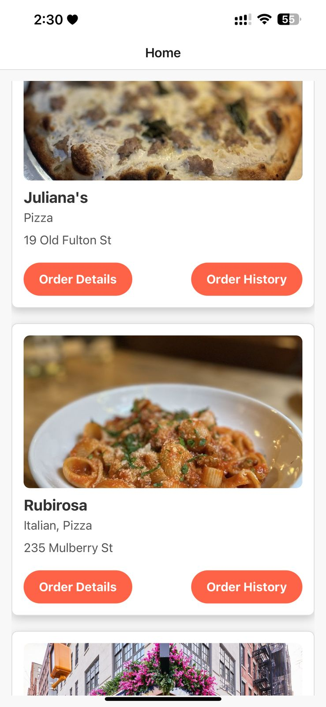
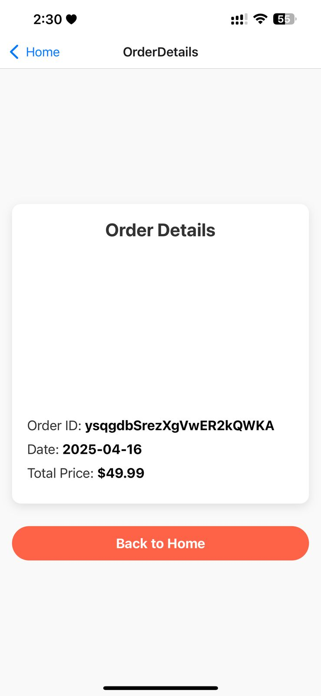
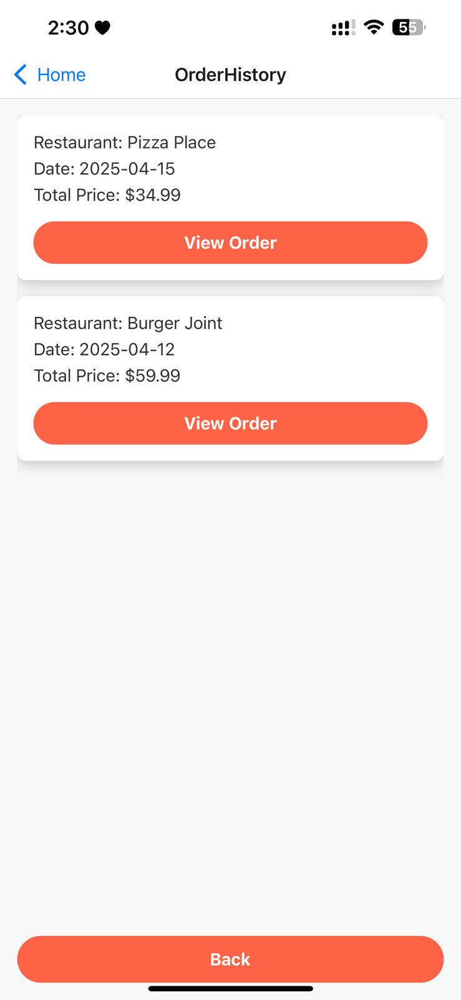
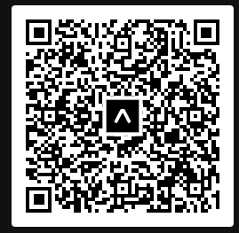

# 🍔 Food Delivery App

A sleek and responsive **Food Delivery App** built with **React Native** using **Expo**. This project integrates with the **Yelp API** to fetch real restaurant data and provide a real-world delivery app experience. It includes a Home screen, Order Details, and Order History features—perfect for learning or building on top of food ordering experiences.


---

## ✨ Features

- 🏠 **Home Screen** – Browse top-rated restaurants with real-time Yelp data.
- 📦 **Order Details Screen** – View detailed order and restaurant information with images.
- 📜 **Order History Screen** – Access your past orders in an organized format.

---

## 📸 Screenshots

### 🏠 Home Screen  


### 📦 Order Details Screen  


### 📜 Order History Screen  


---

## 🚀 Quick Start

### 📦 Prerequisites

- Install [Node.js](https://nodejs.org/)
- Install [Expo CLI](https://docs.expo.dev/workflow/expo-cli/) globally:

```bash
npm install -g expo-cli
```

---

### 📂 Installation

Clone the repository:

```bash
git clone https://github.com/yourusername/food-delivery-app.git
cd food-delivery-app
```

Install dependencies:

```bash
npm install
```

Start the development server:

```bash
expo start
```

---

## 📱 Running the App

You can scan the QR code below using the **Expo Go** app on your mobile device:

### 🔳 App QR Code  
**Filename**: `food_qr.png`  
Scan to launch instantly:



---

## 🎥 Demo

Watch a short demo of the app in action:  
🔗 [Watch the video here](https://youtube.com/shorts/t0lfiE_IbWY?feature=share)

---

## 📁 Folder Structure

```
food-delivery-app/
│
├── assets/
│   ├── Home.jpeg
│   ├── orderdetails.jpeg
│   ├── orderhistory.jpeg
│   └── food_qr.png
│
├── App.js
├── package.json
├── README.md
└── ...
```

---

## 📄 License

This project is licensed under the **MIT License**.  
See the [LICENSE](./LICENSE) file for details.

> **Note**: All images and assets are used for demonstration purposes only.

---

## 📥 Download the Project

Prefer downloading directly?  
[Click here to download the zipped project](https://Tanveer-hub570/My-Portfolio/A2-API-Integration/food-delivery-app/archive/refs/heads/main.zip)

---

## 🙋‍♂️ Need Help?

If you have questions or need help setting up the project, feel free to [open an issue](https://github.com/Tanveer-hub570/My-Portfolio/tree/main/A2%20API%20Integration/Food-Delivery/issues) or reach out directly!

---