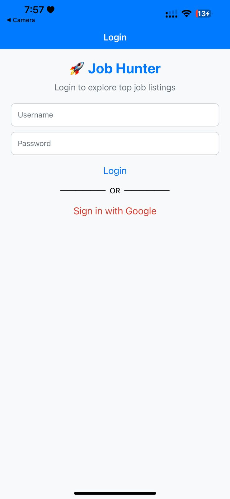
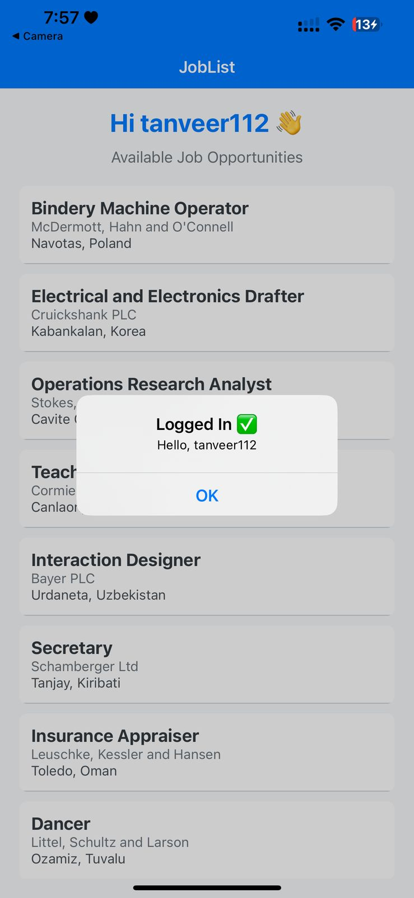
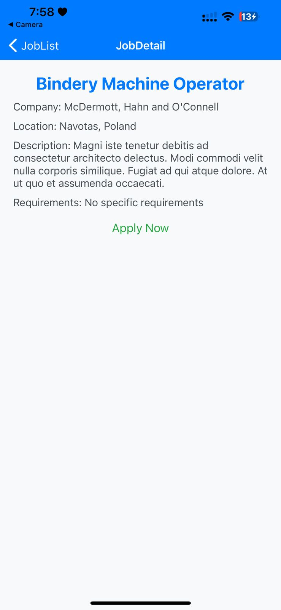

# 💼 Job Listing App

A full-featured **Job Listing App** built with **React Native**, **Node.js**, and **MongoDB**. This app demonstrates social authentication using **Google Login via Firebase**, data storage with MongoDB, and real-time job fetching from an external API. It's a comprehensive solution ideal for learning full-stack mobile development.


---

## ✨ Features

- 🔐 **Google Login** – Firebase-based social authentication.
- 📄 **Job Listing Screen** – View all jobs from MongoDB.
- 📌 **Job Details Screen** – In-depth job descriptions and requirements.
- 📤 **AsyncStorage Support** – Offline access to job listings.
- 🚪 **Logout Button** – Clear session data securely.

---

## 📸 Screenshots

### 🔐 Login Screen  


### 🏠 Home Screen  


### 📋 Job Details Screen  


---

## 🚀 Quick Start

### 📦 Prerequisites

- [Node.js](https://nodejs.org/) & [npm](https://www.npmjs.com/)
- [Expo CLI](https://docs.expo.dev/workflow/expo-cli/)
- [MongoDB Atlas](https://www.mongodb.com/cloud/atlas) or local MongoDB instance
- Firebase Project with Google Sign-In enabled

---

### 📂 Installation

Clone the repository:

```bash
git clone https://github.com/yourusername/job-listing-app.git
cd job-listing-app
```

Install frontend dependencies:

```bash
cd frontend
npm install
```

Install backend dependencies:

```bash
cd ../backend
npm install
```

Start the backend server:

```bash
node server.js
```

Start the React Native frontend:

```bash
cd ../frontend
expo start
```

---

## 📱 Running the App

Scan the QR code below using the **Expo Go** app on your mobile device:

### 🔳 App QR Code  
**Filename**: `mid-qr.png`  


---

## 🎥 Demo

Watch the full demo here:  
🔗 [YouTube Short](https://youtube.com/shorts/Y93-si7HlGQ?feature=share)

---

## 📁 Folder Structure

```
job-listing-app/
│
├── frontend/
│   ├── assets/
│   │   ├── Login.jpeg
│   │   ├── Home.jpeg
│   │   ├── Details.jpeg
│   │   └── mid-qr.png
│   ├── App.js
│   ├── screens/
│   │   ├── Login.js
│   │   ├── Home.js
│   │   └── Details.js
│   └── ...
│
├── backend/
│   ├── server.js
│   ├── routes/
│   └── models/
│
├── README.md
└── ...
```

---

## 📄 License

This project is licensed under the **MIT License**.  
See the [LICENSE](./LICENSE) file for details.

> **Note:** Images and user data shown in the app are for demo purposes only.

---

## 📥 Download the Project

Want a local copy?  
[Click here to download the ZIP](https://github.com/yourusername/job-listing-app/archive/refs/heads/main.zip)

---

## 🙋‍♂️ Need Help?

For setup issues or questions, feel free to [open an issue](https://github.com/yourusername/job-listing-app/issues) or reach out directly.

---
